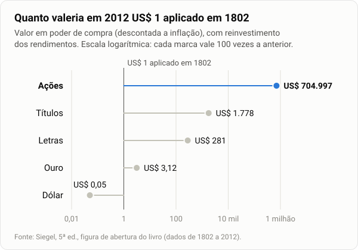
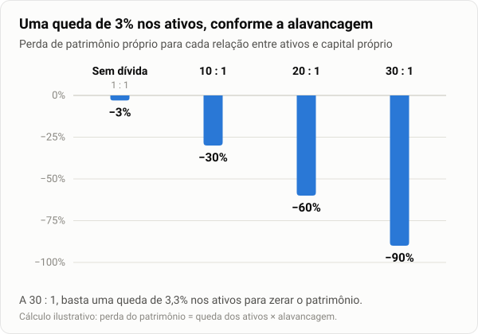
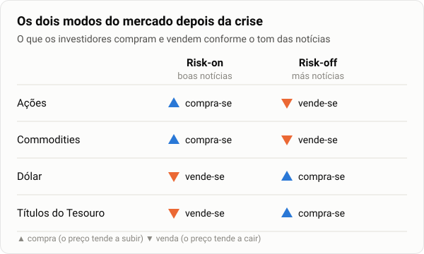
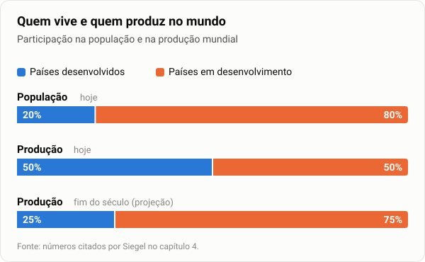
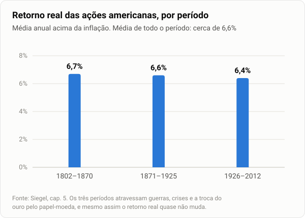
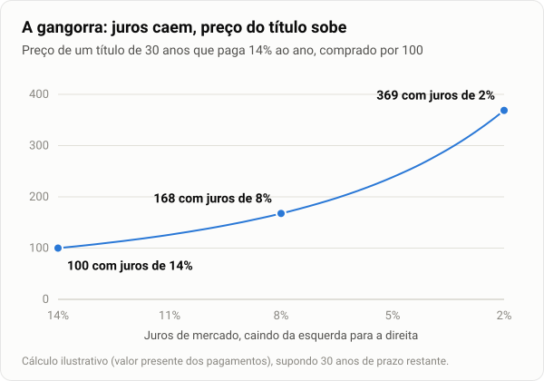
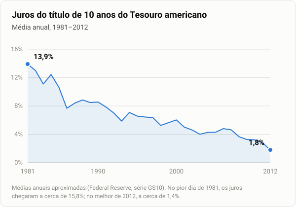
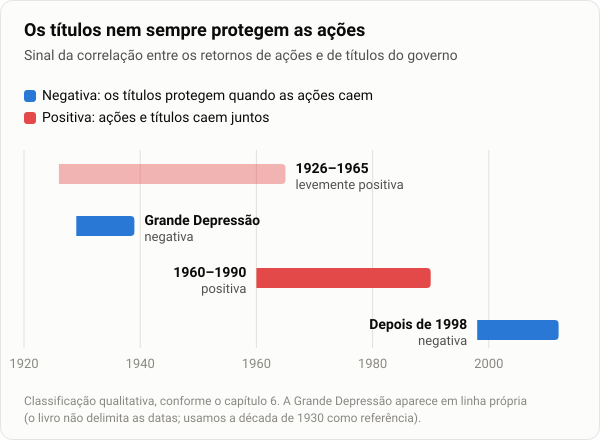
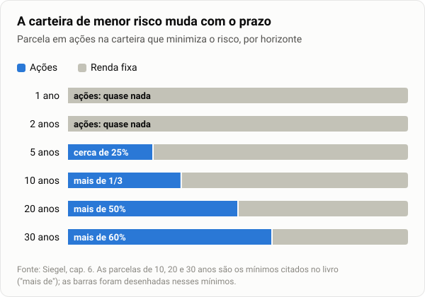
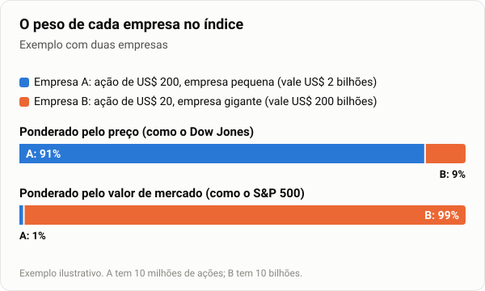

# Investindo em ações no longo prazo

### Jeremy J. Siegel — resumo didático

*Partes I e II, capítulos 1 a 7. As notas de origem terminam no início do capítulo 8.*

---

## Antes de começar

**O autor e o livro.** Jeremy Siegel é professor de finanças da Wharton School, da Universidade da Pensilvânia. *Stocks for the Long Run*, título original do livro, saiu em 1994 e virou um clássico para quem investe em ações. Esta é a 5ª edição (2014), que incorpora a crise de 2008 e usa dados até 2012. Por isso o texto fala em "hoje" referindo-se ao começo da década de 2010.

**Três distinções que atravessam o livro.** Quase tudo o que Siegel diz depende delas, e vale fixá-las desde já:

1. **Nominal × real.** O retorno nominal é medido em dinheiro. O real é o que sobra depois de descontada a inflação. Render 10% num ano de inflação de 10% é ficar parado. O livro raciocina sempre em termos **reais**, porque o que interessa ao investidor é o poder de compra.
2. **Ações × renda fixa.** A ação é uma fatia de uma empresa: o acionista participa dos lucros, sem nenhum valor garantido. A renda fixa é um empréstimo: o investidor recebe juros e o valor combinado, nem mais, nem menos. O livro compara as ações com dois tipos de dívida do governo americano:
   - as **letras do Tesouro** (*T-bills*), de prazo curto (até um ano), que funcionam quase como dinheiro em caixa;
   - os **títulos do Tesouro** de longo prazo (*T-bonds*), que pagam juros fixos por muitos anos.
3. **Curto × longo prazo.** O que é arriscado em um ano pode ser seguro em trinta, e vice-versa. Essa é, no fundo, a tese do livro.

> 🇧🇷 **No Brasil.** As letras do Tesouro cumprem o papel que aqui cabe ao Tesouro Selic: aplicação de curtíssimo prazo, quase caixa. Os títulos longos americanos se parecem com um Tesouro Prefixado de prazo longo: juros fixos em moeda por muitos anos. E os títulos americanos protegidos contra a inflação (*TIPS*), que aparecem no capítulo 6, são o equivalente do nosso Tesouro IPCA+.

**Como ler este texto.** O corpo do texto segue o livro. Os quadros destacados acrescentam apoio:

- 📘 **Contexto**: quem é quem, o que estava acontecendo na época;
- 💡 **Para entender**: o mecanismo por trás de uma ideia, com exemplo;
- 🇧🇷 **No Brasil**: o paralelo com a experiência brasileira;
- 🕰️ **Depois do livro**: o que aconteceu depois de 2012 com as previsões do autor.

As figuras usam dados do livro ou cálculos ilustrativos, indicados em cada uma.

---

## PARTE I — RETORNO DAS AÇÕES: PASSADO, PRESENTE E FUTURO

### Capítulo 1 — Um argumento a favor das ações

O livro abre com a tese que vai defender até o fim: no longo prazo, as ações são o melhor investimento disponível. Comparadas com os títulos de longo prazo do governo americano, com as letras do Tesouro, com o ouro ou com o próprio dólar, elas deram historicamente os maiores retornos. E, o que é mais surpreendente, deram também os retornos mais estáveis, desde que se olhe para períodos longos. Essa estabilidade tem um nome, reversão à média: os retornos das ações oscilam, mas tendem a voltar à sua média histórica.

*Figura 1 — A imagem que abre o livro. Em dois séculos, cada dólar aplicado em ações virou centenas de milhares; em títulos, menos de dois mil. O ouro mal saiu do lugar, e o dólar guardado perdeu 95% do poder de compra. A escala é logarítmica porque, numa escala comum, todas as barras, menos a das ações, ficariam invisíveis.*

A ressalva vem logo em seguida e é indispensável: no curto prazo, as ações são muito voláteis. A tese não é que as ações sejam tranquilas, mas que a turbulência de curto prazo se dilui no longo prazo. Como no mar, as ondas são violentas e imprevisíveis, enquanto a maré sobe com regularidade.

Essa tese tem uma história. Durante muito tempo acreditou-se, e Irving Fisher estava entre os que acreditavam, que as ações só superavam os títulos em períodos de inflação alta; nos períodos de queda de preços, os títulos levariam vantagem. Edgar Lawrence Smith mostrou que isso era falso: as ações superavam os títulos também nos períodos de deflação. Mostrou ainda que era pequena a probabilidade de o investidor precisar esperar muito tempo (entre 6 e 15 anos) para vender suas ações com lucro. Nos dados mais recentes, essa espera tem sido ainda menor que a média histórica.

> 📘 **Contexto — os personagens.** **Irving Fisher** (1867–1947), professor de Yale, era o economista americano mais famoso do seu tempo; até hoje se estuda a "equação de Fisher", que separa os juros nominais da inflação. **Edgar Lawrence Smith** era um gestor de investimentos que publicou, em 1924, *Common Stocks as Long-Term Investments* ("Ações como investimento de longo prazo"). Ele pretendia provar que os títulos venciam nas deflações e acabou provando o contrário. **Benjamin Graham**, citado no fim do capítulo, é o pai do chamado investimento em valor, autor de *Security Analysis* (1934, com David Dodd) e de *O investidor inteligente* (1949).

Os estudos de Smith convenceram o próprio Fisher, que mudou de opinião e passou a apontar quatro erros do mercado:

1. superestima a segurança dos títulos "seguros" e, por isso, paga caro demais por eles;
2. superestima o risco dos títulos arriscados e, por isso, paga pouco por eles;
3. paga demais por retornos imediatos e pouco por retornos distantes;
4. confunde a estabilidade do ganho nominal, que os títulos de renda fixa têm, com a estabilidade do ganho real, que eles não têm.

O quarto erro é a semente do livro inteiro. Um título que paga juros fixos nunca mostra prejuízo no extrato; mas, se a inflação for maior que os juros, o poder de compra do investidor encolhe ano após ano. Estabilidade em moeda não é estabilidade em riqueza.

> 💡 **Para entender — a ilusão monetária em números.** Um título paga 5% ao ano, e a inflação é de 7%. O extrato mostra o saldo subindo todo ano. Mas o ganho real é de (1,05 ÷ 1,07) − 1 ≈ −1,9% ao ano. Em dez anos, o investidor terá perdido cerca de 17% do poder de compra, sem que o extrato registre um único centavo de prejuízo. É disso que Fisher fala: o mercado vê a estabilidade do número e não percebe a erosão do valor.

A ironia é que o próprio Fisher caiu em desgraça pouco depois. Em meados de outubro de 1929, dias antes do crash, ele garantiu aos investidores que as ações haviam "atingido algo semelhante a um patamar permanentemente alto". A crise que se seguiu esfriou o entusiasmo, e as ações voltaram a ser vistas como especulação. Só com o tempo essa visão foi revertida, à medida que novos estudos confirmaram a hipótese de Smith, ainda que Benjamin Graham considerasse o livro dele incompleto.

> 📘 **Contexto — o tamanho do desastre.** Entre setembro de 1929 e julho de 1932, o índice Dow Jones caiu de 381 para 41 pontos, uma perda de 89%. O índice só voltou ao pico de 1929 em 1954. Esse número, porém, exagera a demora: ele mede apenas preços, sem os dividendos, e os preços em geral caíram muito na década de 1930. Para quem reinvestiu os dividendos, a recuperação real veio bem antes. De todo modo, a geração que viveu 1929 passou décadas desconfiando da bolsa, e é contra essa desconfiança que Siegel escreve.

**Em poucas palavras**
- No longo prazo, as ações renderam mais que qualquer outro ativo, e de forma mais estável.
- No curto prazo, são muito voláteis; a estabilidade só aparece com o tempo.
- O risco da renda fixa é escondido: ela é estável em moeda, não em poder de compra.

---

### Capítulo 2 — A grande crise financeira de 2008: origem, impacto e legado

Os anos que antecederam a crise foram de estabilidade incomum. As principais variáveis econômicas oscilavam pouco, e o período ficou conhecido como **Grande Moderação**. É aí que começa a explicação do autor, porque foi a calma prolongada que preparou a tempestade.

> 📘 **Contexto — a Grande Moderação e a crise.** O nome foi popularizado por Ben Bernanke, então diretor do Federal Reserve (o banco central americano), num discurso de 2004. Ele descrevia as duas décadas, desde meados dos anos 1980, de inflação baixa e recessões raras e brandas. A crise veio em etapas: os preços dos imóveis americanos atingiram o pico em 2006; em setembro de 2008, o banco Lehman Brothers quebrou e a seguradora AIG teve de ser socorrida. Entre outubro de 2007 e março de 2009, o índice S&P 500 caiu cerca de 57%.

A crise foi tão grave porque as instituições financeiras estavam superalavancadas em ativos de risco, isto é, tinham comprado esses ativos em grande parte com dinheiro emprestado. É isso que a distingue do estouro da bolha das empresas de tecnologia, na virada do século. Naquela ocasião, quem perdeu, perdeu o próprio dinheiro. Em 2008, as perdas recaíram sobre instituições que deviam a todo o sistema, e o prejuízo se propagou em cadeia.

> 📘 **Contexto — a bolha de 2000.** Entre março de 2000 e outubro de 2002, o índice Nasdaq, carregado de empresas de tecnologia e internet, caiu cerca de 78%. Foi uma perda enorme, mas concentrada em investidores que usavam recursos próprios. Os bancos não estavam pendurados nessas ações, e o sistema financeiro passou pelo episódio sem quebrar.

A aritmética da alavancagem explica a fragilidade: uma instituição com 30 unidades de ativos para cada unidade de capital próprio perde todo o patrimônio se seus ativos caírem pouco mais de 3%.

*Figura 2 — A alavancagem multiplica a perda. Quem compra sem dívida e vê os ativos caírem 3% perde 3% do patrimônio. Quem compra com 29 partes de dinheiro emprestado para cada parte própria perde 90%. Como as dívidas continuam devidas, a perda inteira recai sobre o pequeno capital próprio.*

Por que as instituições se alavancaram tanto? O autor aponta quatro causas, que se reforçam mutuamente:

- a subestimação do risco, alimentada pelo longo período de estabilidade da Grande Moderação;
- a classificação equivocada dos títulos garantidos por hipotecas;
- o apoio do establishment político à ampliação do acesso à casa própria;
- a falta de supervisão dos órgãos reguladores.

> 💡 **Para entender — os títulos garantidos por hipotecas.** Os bancos reuniam milhares de financiamentos imobiliários num pacote e o vendiam a investidores em forma de títulos. Quem comprava o título recebia as prestações pagas pelos mutuários. Muitos desses pacotes incluíam financiamentos *subprime*, concedidos a pessoas com pouca capacidade de pagamento. Ainda assim, as agências de classificação de risco deram a muitos deles a nota máxima (AAA), a mesma de um título do governo. Quando os mutuários deixaram de pagar, papéis tratados como seguríssimos perderam boa parte do valor, e as instituições que os haviam comprado com dinheiro emprestado ficaram insolventes.

> **Observação pessoal:** o autor subestima o papel da política monetária frouxa, que está na origem de todos os problemas acima.

**Em poucas palavras**
- A estabilidade prolongada da Grande Moderação levou o mercado a subestimar o risco.
- O que transformou perdas em crise sistêmica foi a alavancagem das instituições financeiras.
- Erros de classificação, política habitacional e regulação frouxa empurraram nessa direção.

---

### Capítulo 3 — Mercados, economia e política governamental na esteira da crise

Para mostrar o que mudou nos mercados depois da crise, o autor parte de duas ferramentas.

A primeira é o **índice de volatilidade VIX**, que mede, na prática, quanto custa "fazer seguro" de uma carteira de ações. Ele é calculado a partir do prêmio embutido nas opções de compra e de venda negociadas no mercado acionário: quanto mais caras as opções, maior a volatilidade que o mercado espera. O VIX funciona, assim, como um termômetro do medo.

> 💡 **Para entender — opções como seguro.** Uma opção de venda (*put*) dá ao comprador o direito de vender uma ação por um preço combinado, mesmo que ela despenque. É, literalmente, um seguro contra a queda. Como todo seguro, o preço sobe quando o risco percebido aumenta. Em tempos calmos, o VIX costuma ficar entre 10 e 20 pontos. Em novembro de 2008, fechou acima de 80, recorde que só seria superado em março de 2020, no início da pandemia.

A segunda é a noção de **correlação**. Dois ativos têm correlação positiva quando sobem e caem juntos; têm correlação negativa quando a queda de um vem acompanhada da alta do outro, e vice-versa. Para quem quer diversificar, interessam os ativos que não se movem juntos.

Com essas ferramentas, o autor examina como a crise alterou a relação entre as ações e as demais classes de ativos.

**Ações internacionais.** A correlação entre os mercados acionários dos países desenvolvidos e os dos emergentes aumentou. Alguns concluíram daí que não haveria mais razão para diversificar a carteira com investimentos no exterior. O autor discorda: a correlação de longo prazo entre os mercados acionários é significativamente menor que a de curto prazo. Nas crises, todos correm para a mesma porta; fora delas, cada mercado segue seu caminho. Para o investidor de longo prazo, a diversificação internacional continua valendo a pena.

**Commodities.** Desde a crise, a correlação entre ações e commodities também aumentou. Para entender por quê, é preciso separar as duas forças que movem os preços das commodities: os fatores de demanda, como o crescimento da economia mundial, e os fatores de oferta, como o clima e os eventos políticos. As flutuações de demanda movem commodities e ações na mesma direção: se a economia mundial acelera, as duas sobem. As flutuações de oferta as movem em direções opostas: uma quebra de safra ou uma guerra encarece as commodities e prejudica as empresas. Só no segundo caso as commodities protegem a carteira de ações.

| Origem do choque | Exemplo | Commodities | Ações | Correlação | Protege a carteira? |
|---|---|---|---|---|---|
| **Demanda** | A economia mundial acelera ou desacelera | Sobem / caem | Sobem / caem | Positiva | Não |
| **Oferta** | Quebra de safra, guerra, embargo | Sobem | Caem | Negativa | Sim |

Há motivos para crer que a correlação positiva continuará alta. Já não se acredita que a Opep tenha sobre a oferta de petróleo o poder que tinha no passado. As flutuações de demanda tendem, então, a predominar, e, nesse cenário, as commodities perdem a função de proteção eficaz contra as oscilações das ações.

> 📘 **Contexto — a Opep e os choques do petróleo.** A Organização dos Países Exportadores de Petróleo protagonizou os grandes choques de oferta do século XX. Em 1973, o embargo árabe quadruplicou o preço do petróleo; em 1979, a revolução iraniana o fez disparar de novo. Nos dois casos, o petróleo subiu e as bolsas caíram, ou seja, a correlação foi negativa. Desde então, o surgimento de novos produtores, como os de petróleo de xisto nos EUA a partir de 2010, reduziu o poder do cartel de mover os preços pela oferta.

**Dólar.** Com o dólar e os títulos do Tesouro americano, a correlação com as ações é menor. O preço do dólar no mercado de câmbio responde a duas forças. A primeira é a solidez da economia americana, que o aproxima das ações (correlação positiva). A segunda é o seu status de paraíso seguro, que o afasta delas (correlação negativa). Por isso, notícias ruins, sobretudo de fora dos EUA, derrubam as ações nos mercados americano e internacionais, mas valorizam o dólar, visto como refúgio nas crises.

**Títulos do Tesouro americano.** Os títulos do Tesouro também gozam do status de paraíso seguro. Diante de notícias ruins, de dentro ou de fora dos EUA, os investidores correm para eles. Daí a forte correlação negativa entre o preço dos títulos e o das ações. Para o investidor cuja moeda não é o dólar, essa correlação é ainda maior: numa crise, ele ganha duas vezes, com a alta do preço do título e com a valorização do dólar frente à sua moeda.

> 🇧🇷 **No Brasil — o duplo ganho na prática.** Em 2008, o dólar passou de cerca de R$ 1,56, no início de agosto, para cerca de R$ 2,34 no fim de dezembro, uma alta de quase 50%. O brasileiro que tinha títulos do Tesouro americano ganhou com a valorização dos títulos e, sobretudo, com a do dólar, justamente nos meses em que a bolsa brasileira despencava. É por isso que o dólar costuma ser a principal proteção de uma carteira brasileira em crises globais.

**Ouro.** O ouro é a única classe de ativos cuja correlação com o mercado acionário não foi afetada pela crise. Ela se mantém próxima de zero há 50 anos.

**Risk-on, risk-off.** A correlação positiva das ações com as commodities e o petróleo, somada à correlação negativa das ações com o dólar e os títulos do Tesouro, deu origem à expressão "mercado *risk-on/risk-off*" (literalmente, "risco ligado / risco desligado"). O mercado passou a alternar entre dois modos. No modo *risk-on*, boas notícias econômicas levam os investidores a comprar ações e commodities e a vender dólares e títulos do Tesouro. No modo *risk-off*, notícias ruins produzem o movimento inverso: compram-se títulos do Tesouro e dólares, vendem-se ações e commodities.

*Figura 3 — O mercado em dois modos. As quatro classes de ativos se movem em bloco, conforme o tom das notícias. Quem tem ações e quer se proteger precisa de algo da metade de baixo do quadro.*

**A advertência.** O capítulo termina com um alerta: as correlações entre as classes de ativos não são historicamente estáveis, e confiar nelas pode ser perigoso. Nas décadas de 1970 e 1980, a correlação entre títulos e ações era positiva, e não negativa como agora. Os títulos só servem de paraíso seguro contra a instabilidade do setor privado quando não há ameaça de inflação. Naquelas décadas havia, e, diante da política monetária atual, a preocupação com a inflação voltou a ser grande. Se a inflação subir, os títulos deixarão de diversificar a carteira. O mercado altista dos títulos do Tesouro não tem precedentes e se apoia apenas na convicção de que eles seriam uma "apólice de seguro". Pode ter um fim tão drástico quanto a queda das ações de tecnologia na virada do século, quando o crescimento econômico se intensificar e a inflação subir.

> 💡 **Para entender — por que a inflação muda o sinal da correlação.** Numa crise sem inflação, o banco central corta os juros para estimular a economia. Juros menores valorizam os títulos já emitidos (o mecanismo é explicado no capítulo 5), e assim os títulos sobem enquanto as ações caem. Numa crise com inflação, o banco central precisa **subir** os juros para conter os preços. Juros maiores derrubam os títulos e, ao mesmo tempo, encarecem o crédito e prejudicam as empresas. Ações e títulos caem juntos, e o seguro falha quando mais se precisa dele.

> 🕰️ **Depois do livro.** A advertência se confirmou. Em 2022, com a inflação americana chegando a 9,1% em junho, o Federal Reserve subiu os juros com rapidez. No ano, o S&P 500 caiu cerca de 18% (já contando os dividendos), e o índice agregado de títulos americanos caiu cerca de 13%, o seu pior ano em quase meio século. Ações e títulos caíram juntos, exatamente como Siegel previa.

**Em poucas palavras**
- Diversificar no exterior continua valendo, porque no longo prazo as bolsas se movem menos juntas do que nas crises.
- Commodities só protegem contra choques de oferta; dólar e títulos do Tesouro protegem nas crises, desde que não haja inflação.
- As correlações mudam com o regime de inflação; quem as trata como constantes pode ficar sem proteção na hora errada.

---

### Capítulo 4 — A crise dos benefícios sociais: a onda de envelhecimento inundará o mercado acionário?

Duas forças opostas vão afetar decisivamente a economia mundial nas próximas décadas, e o capítulo é o confronto entre elas.

A primeira é a **onda de envelhecimento**. O número inédito de pessoas prestes a se aposentar no mundo desenvolvido produz déficits orçamentários crescentes e consome os programas de previdência, públicos e privados. Daí a pergunta que move o capítulo: quem vai comprar os ativos que os aposentados pretendem vender para financiar a própria aposentadoria?

A segunda é o **crescimento das economias emergentes**, que em breve superarão a participação dos países desenvolvidos na economia mundial. A maior produtividade dessas economias pode contrabalançar o envelhecimento do mundo rico. A questão é se elas serão produtivas o bastante para comprar os ativos dos novos aposentados.

#### O problema

O envelhecimento resulta de quatro tendências que se somam.

A primeira é a **queda da natalidade**. Depois da geração *baby boom*, nascida com taxas de natalidade bem acima das décadas anteriores, a natalidade caiu no mundo todo.

> 📘 **Contexto — os *baby boomers*.** São os nascidos entre 1946 e 1964, depois da Segunda Guerra Mundial, quando a natalidade disparou nos EUA e em boa parte da Europa. É uma geração numerosíssima, que começou a se aposentar por volta de 2010, justamente quando Siegel escrevia esta edição.

A segunda é o **aumento da expectativa de vida**, graças aos avanços da medicina e das condições de vida.

A terceira decorre das duas primeiras: uma **mudança drástica na distribuição etária** dos países desenvolvidos. Em meados do século XXI, em países como Japão, Grécia, Espanha e Portugal, a faixa etária mais populosa será a de 70 a 80 anos, e haverá mais pessoas acima de 80 do que crianças abaixo de 15.

A quarta é a mais paradoxal: enquanto a expectativa de vida subia, **a idade de aposentadoria caía**. Nos EUA, o tempo médio que uma pessoa passa aposentada saltou de 1,6 para 15,8 anos.

Essa combinação de vida mais longa com aposentadoria mais cedo não pode continuar, e a razão é simples: o que os aposentados consomem precisa ser produzido por alguém. Isso tem duas consequências.

A primeira é o **aumento da demanda por bens e serviços**. Os aposentados, parcela cada vez maior da população, consomem sem produzir, e têm com que consumir, porque recebem aposentadoria. A demanda cresce sem que a produção a acompanhe. O problema não se limita aos países que envelhecem: como bens e serviços são negociados em mercados globais, a demanda dos futuros aposentados empurrará os preços para cima no mundo todo e prejudicará também os aposentados de outros países.

> 💡 **Para entender — repartição e capitalização.** Há duas formas de financiar aposentadorias. Na **repartição**, os trabalhadores de hoje pagam as aposentadorias de hoje: é um pacto entre gerações, e o envelhecimento o atinge diretamente, porque cada vez menos contribuintes sustentam cada vez mais beneficiários. Na **capitalização**, cada pessoa acumula, ao longo da vida ativa, uma reserva própria aplicada em ativos, que vende aos poucos depois de se aposentar.

Poder-se-ia pensar que isso não seria um problema num sistema de capitalização, já que nele o consumo do aposentado é apenas a contrapartida do consumo de que ele abriu mão, a poupança, ao longo da vida ativa. A objeção, porém, não se sustenta. A poupança não é um estoque de bens guardado no armário; é um conjunto de direitos sobre a produção futura. Se, quando chegar a hora de exercer esses direitos, houver poucos trabalhadores produzindo, o problema reaparece, seja nos preços dos bens, seja nos preços dos próprios ativos. É o que mostra a segunda consequência.

A segunda consequência é a **queda no valor dos ativos que garantem a aposentadoria**. Sem renda do trabalho, os aposentados vendem ativos para viver. Quem os compra são os poupadores: pessoas em idade ativa que consomem menos do que ganham e compram ativos para guardar parte da renda para a própria aposentadoria. Quando há mais vendedores (aposentados) que compradores (trabalhadores), os preços desses ativos tendem a cair. Imagine um leilão em que metade da sala quer vender e pouca gente quer comprar: o martelo bate em preços cada vez mais baixos.

Com bens mais caros e ativos mais baratos, os *baby boomers* terão de trabalhar mais tempo e se aposentar mais tarde. Quanto mais tarde? Se os aposentados do mundo desenvolvido dependessem apenas da renda gerada pelos trabalhadores do próprio mundo desenvolvido, a idade de aposentadoria teria de subir enormemente (nos EUA, para 77 anos), muito acima do aumento da expectativa de vida.

> 🇧🇷 **No Brasil.** O INSS funciona por repartição, e o Brasil envelhece depressa: a fecundidade está abaixo do nível de reposição (cerca de 2,1 filhos por mulher) desde meados dos anos 2000, e a projeção do IBGE divulgada em 2024 indica que a população deve começar a diminuir no início da década de 2040. A reforma da Previdência de 2019 (Emenda Constitucional 103) fixou idades mínimas de 65 anos para homens e 62 para mulheres. É a mesma conta de Siegel: menos trabalhadores por aposentado obrigam a trabalhar mais tempo ou a receber menos.

#### O problema à luz de um mercado global

Análises desse tipo produziram previsões pessimistas sobre o retorno dos ativos, e há quem projete o retorno dos ativos de um país apenas com base na sua demografia. O autor considera isso um erro, porque o mundo é cada vez mais uma única economia. No futuro, os jovens das economias em desenvolvimento poderão compensar o envelhecimento do mundo desenvolvido.

É verdade que a proporção de aposentados cresce em quase todos os países. Mas, exceto na China, por causa da política do filho único, esse aumento é mais gradual nos países em desenvolvimento. Também é verdade que essas economias ainda não produzem o suficiente para atender à demanda dos futuros aposentados dos países ricos. Hoje, os países desenvolvidos têm 20% da população e 50% da produção mundial; os países em desenvolvimento, 80% da população e os outros 50%.

Essa proporção, porém, muda rapidamente. Até o fim do século, estima-se que as economias emergentes produzirão três quartos do PIB mundial.

*Figura 4 — O desequilíbrio que vai se desfazer. Hoje, um quinto da população mundial produz metade de tudo; o resto do mundo é numeroso, mas ainda pouco produtivo. As projeções citadas por Siegel indicam que, até o fim do século, a produção se aproximará da população.*

Por regiões, as projeções citadas pelo autor são estas:

- a **China** chegará a 32% da produção mundial, mas deverá recuar para 14% até o fim do século, por causa da política do filho único e da desaceleração natural de uma economia que se aproxima da riqueza dos países desenvolvidos;
- a **Índia**, embora hoje cresça menos que a China, deverá ultrapassar a produção chinesa em 2060 e responder por 25% do PIB mundial no fim do século;
- a **África** deve continuar sendo uma parcela pequena da economia mundial até 2070; depois disso, deve crescer até alcançar, no fim do século, uma produção equivalente à da China (projeção que o autor considera conservadora).

> 📘 **Contexto — a política do filho único.** Adotada pela China em 1980 e abandonada em 2015, limitou a maioria das famílias urbanas a um filho. Produziu uma queda brusca da natalidade e um envelhecimento muito mais rápido que o de outros países em desenvolvimento. Por isso a China aparece, nas projeções, como a exceção que perde participação no fim do século.

Esse crescimento terá impacto profundo sobre os países desenvolvidos. Os bens procurados pelos aposentados do mundo rico serão produzidos pelos trabalhadores do mundo em desenvolvimento. A renda desses trabalhadores aumentará o seu consumo, claro, mas também a sua poupança, e os países asiáticos têm altos índices de poupança. É essa poupança que pode impedir que os mercados financeiros do mundo desenvolvido sejam dominados pelos ativos vendidos pelos *baby boomers*.

Os números do autor mostram o tamanho desse efeito. Se os mercados emergentes crescerem, em média, 4,5% ao ano na segunda metade do século (a média desde 1990), a idade de aposentadoria nos EUA ficará em torno de 68 anos, que é basicamente a idade atual acrescida do aumento futuro da expectativa de vida. Se crescerem no ritmo médio da China, de 9% ao ano (cenário extremamente otimista), a idade de aposentadoria nos EUA continuará a cair, a ponto de ficar inacreditáveis 26,2 anos abaixo da expectativa de vida.

| Cenário | Idade de aposentadoria nos EUA |
|---|---|
| Só os trabalhadores do mundo desenvolvido sustentam os aposentados | cerca de 77 anos |
| Emergentes crescem 4,5% ao ano | cerca de 68 anos |
| Emergentes crescem 9% ao ano (muito otimista) | continua a cair |

**A resposta ao problema**, portanto, é esta: os trabalhadores e investidores dos países em desenvolvimento comprarão os ativos dos aposentados dos países desenvolvidos e, com o tempo, terão participação majoritária nas grandes corporações globais.

Mas por que comprariam empresas ocidentais, em vez de investir nos próprios mercados? Porque, num ambiente global, as perspectivas de uma empresa já não estão atreladas ao seu país de origem. O próprio crescimento dos emergentes criará uma nova classe média, para a qual as empresas ocidentais terão a oportunidade de vender.

#### A produtividade dará conta?

Resta a pergunta de que tudo depende: o crescimento da produtividade conseguirá sustentar um crescimento médio de 4,5% ao ano?

É a produtividade que eleva o padrão de vida. Nos países em desenvolvimento, ela cresce rápido porque toma emprestada a tecnologia criada nas economias avançadas. Nos países desenvolvidos, que já operam na fronteira do conhecimento tecnológico, o ganho de produtividade depende de inovação e, por isso, é menor: historicamente, de 2% a 2,5% ao ano.

> 💡 **Para entender — copiar é mais rápido que inventar.** Um país que ainda não tem eletricidade em todas as casas, estradas pavimentadas ou internet pode adotar essas tecnologias prontas, testadas e baratas, e ganhar produtividade aos saltos. Um país que já tem tudo isso só cresce se alguém inventar algo novo, o que é mais lento e incerto. É por isso que os emergentes podem crescer bem mais rápido que os ricos durante décadas, até alcançá-los.

Há muito pessimismo a esse respeito. Diz-se que o aumento da produtividade está fadado a cair, que as novas tecnologias não terão o impacto das inovações do século XX (as invenções da primeira metade do século, aliás, teriam sido mais transformadoras que as da segunda) e que o novo normal será um ganho médio de 1% ou 2% ao ano.

> 📘 **Contexto — a tese pessimista.** O nome mais associado a ela é o do economista Robert Gordon, que em 2012 publicou o artigo "Is U.S. Economic Growth Over?" ("O crescimento americano acabou?"). O argumento: eletricidade, motor a combustão, água encanada e antibióticos mudaram a vida humana muito mais do que os computadores e os celulares, e inovações desse porte não se repetem.

O autor discorda por três razões. Primeiro, uma eventual desaceleração da produtividade nos EUA não implica desaceleração no resto do mundo: muitas das tecnologias básicas descobertas no século XX ainda não chegaram a vários países em desenvolvimento. Segundo, ele não acredita sequer que a produtividade esteja caindo no mundo desenvolvido, dadas as transformações da era digital. Terceiro, cita um estudo segundo o qual a pesquisa feita no mundo inteiro, e não apenas a doméstica, respondeu por 50% do crescimento americano entre 1950 e 1993. Com o crescimento dos emergentes e o aumento do número de países inovadores, ou seja, com mais gente com acesso à pesquisa mundial, o crescimento da produtividade não diminuirá; ao contrário, aumentará na próxima década.

**Conclusão:** o crescimento das economias emergentes compensará a queda do número de trabalhadores no mundo desenvolvido, e não haverá estagnação tecnológica. Por consequência, o retorno futuro das ações deve continuar próximo dos níveis históricos.

**Em poucas palavras**
- O envelhecimento do mundo rico ameaça os preços dos ativos: haverá muitos aposentados vendendo e poucos trabalhadores comprando.
- O problema atinge também a capitalização, porque poupança é direito sobre a produção futura.
- A saída é global: os trabalhadores e poupadores dos emergentes comprarão esses ativos, desde que a produtividade continue a crescer.

---

## PARTE II — O VEREDITO DA HISTÓRIA

### Capítulo 5 — Retornos de ações e títulos desde 1802

Antes dos números, uma distinção. O retorno total das ações não é o mesmo que o crescimento do valor total do mercado acionário; é maior. O retorno total supõe que todos os ganhos, inclusive os dividendos, sejam reinvestidos. Na prática, boa parte dos dividendos é gasta pelos investidores e não volta às empresas como capital. Aliás, poucos investidores conseguem acumular riqueza ao longo de grandes períodos sem consumir parte do retorno.

O grande concorrente das ações é a renda fixa, o maior e mais importante ativo com que elas disputam a poupança. A diferença essencial está no contrato: os títulos têm um valor monetário máximo, definido em seus termos, enquanto as ações não têm teto.

Para comparar uma coisa e outra, o critério correto é o poder de compra. O foco do investidor de longo prazo deve ser a criação de riqueza ajustada pelos efeitos da inflação, e é nesses termos (reais, e não nominais) que o autor mede tudo.

O resultado é impressionante: desde 1802, as ações renderam em média cerca de 6,6% ao ano acima da inflação.[^1] Há quem afirme que esse retorno não é sustentável, por ser o dobro da taxa de crescimento do PIB. A objeção ignora dois pontos. Primeiro, o capital, assim como o trabalho, é um recurso escasso, e o seu uso precisa ser remunerado; essa remuneração chega ao acionista na forma de dividendos. Segundo, o retorno total pressupõe que dividendos e ganhos de capital sejam reinvestidos. É natural, portanto, que ele cresça mais que o nível do mercado acionário e mais que o PIB. A árvore cresce no ritmo da economia, mas quem replanta todos os frutos termina com um pomar.

> 💡 **Para entender — de onde vêm os 6,6%.** O retorno de uma ação tem, grosso modo, duas partes: o **dividendo** que a empresa distribui e o **crescimento do lucro**, que faz o preço da ação subir. Por exemplo: se uma empresa distribui todo ano 4,5% do valor da ação em dividendos e o seu lucro cresce 2% acima da inflação, o acionista que reinveste os dividendos obtém cerca de 6,5% reais ao ano, mais do que o triplo do crescimento do lucro. Não há mágica: é o reinvestimento que faz a diferença.

Mais notável que o tamanho do retorno é a sua estabilidade. Em todos os subperíodos da história americana, a taxa real média foi surpreendentemente parecida: 6,7% entre 1802 e 1870, 6,6% entre 1871 e 1925 e 6,4% de 1926 em diante. Os retornos reais também foram praticamente iguais antes e depois da era da inflação. A explicação é que as ações representam ativos reais, como fábricas, terras, marcas e máquinas, cujo valor acompanha a inflação no longo prazo. Por isso, no longo prazo, o nível de preços não as prejudica.

*Figura 5 — Três épocas, quase o mesmo retorno. O primeiro período é o de uma economia agrícola em transição; o segundo, o da industrialização; o terceiro inclui a Grande Depressão, a Segunda Guerra e a inflação do pós-guerra. A diferença entre o melhor e o pior período é de apenas 0,3 ponto por ano.*

> 📘 **Contexto — do ouro ao papel-moeda.** Durante a maior parte do século XIX e o início do XX, o dólar era conversível em ouro, e por isso os preços subiam e desciam, mas no longo prazo quase não saíam do lugar. Em 1933, os EUA suspenderam a conversibilidade interna; em 1971, o presidente Nixon encerrou a conversibilidade internacional. Desde então, o dólar é puro papel-moeda, e a inflação passou a ser permanente. O fato de as ações renderem o mesmo, em termos reais, nos dois regimes é a prova de que elas protegem contra a inflação.

Mas não se deve confundir as coisas: a estabilidade do retorno das ações no longo prazo não garante a mesma estabilidade no curto ou no médio prazo.

> 💡 **Para entender — a força dos juros compostos.** Pequenas diferenças de taxa viram abismos com o tempo. Em 30 anos, cada real aplicado a 6,6% ao ano acima da inflação se transforma em cerca de 6,8 reais de poder de compra; a 3%, em cerca de 2,4. A Figura 1 mostra a mesma lógica levada a dois séculos.

Com a renda fixa, a história é outra. Os seus retornos reais de longo prazo não têm a estabilidade dos das ações. Ainda assim, desde 1981 os títulos tiveram retornos reais consideráveis, praticamente iguais aos das ações. O autor adverte, contudo, que esse desempenho espetacular das últimas três décadas não deve se repetir, e a razão está na mecânica dos títulos. O retorno de um título tem duas fontes: os juros que ele paga e o ganho de capital obtido quando as taxas de mercado caem, pois, quando os juros caem, o preço dos títulos já emitidos sobe. Juros e preço ficam nas pontas de uma gangorra.

> 💡 **Para entender — a gangorra.** Imagine que você comprou, por 100, um título que paga 14 por ano durante 30 anos, porque esses eram os juros da época. Anos depois, os juros de mercado caem para 8%: os títulos novos passam a pagar só 8 por ano. O seu título, que continua pagando 14, fica muito mais desejável, e alguém aceitará pagar bem mais de 100 por ele. Quanto mais os juros caem, mais o seu título vale. O inverso também é verdadeiro: se os juros sobem, o seu título perde valor, porque os novos pagam mais.

*Figura 6 — A gangorra em números. O mesmo título, sem mudar uma vírgula do contrato, passa a valer quase quatro vezes mais apenas porque os juros de mercado caíram de 14% para 2%.*

Foi exatamente isso que aconteceu entre 1981 e 2012. Em 1981, os juros dos títulos do Tesouro americano estavam perto de 16% ao ano; nas três décadas seguintes, caíram para cerca de 1,5%. Quem comprou títulos no início do período recebeu juros altíssimos e ainda viu o preço dos seus papéis subir continuamente. Com os juros já tão baixos, não há espaço para uma nova queda dessa magnitude: os rendimentos reais dos títulos caíram e devem continuar baixos.

*Figura 7 — Trinta anos de ladeira abaixo. A queda contínua dos juros foi o motor do excelente retorno dos títulos desde 1981. Em 2012, a bola já estava no fundo do vale: os juros não tinham como cair outros doze pontos.*

> 📘 **Contexto — por que os juros estavam tão altos em 1981.** No fim dos anos 1970, a inflação americana saiu de controle e chegou a 13,5% em 1980. Paul Volcker, presidente do Federal Reserve de 1979 a 1987, subiu os juros de curto prazo a cerca de 20% para quebrá-la. Funcionou: a inflação caiu nos anos seguintes, e os juros de todos os prazos iniciaram a longa descida da Figura 7.

Isso leva ao **prêmio das ações**, ou prêmio de risco das ações: o retorno que as ações oferecem acima da renda fixa. Por causa do rendimento extraordinário dos títulos de longo prazo nas últimas décadas, esse prêmio, medido nesse período, reduziu-se a zero. A tendência para o futuro, porém, é que seja bem mais alto, justamente porque os rendimentos reais dos títulos de longo prazo caíram muito.

> 💡 **Para entender — o prêmio olhando para trás e para frente.** Ao longo dos dois séculos, as ações renderam cerca de 6,6% reais ao ano e os títulos cerca de 3,6%: um prêmio de uns 3 pontos. Entre 1981 e 2012, a queda dos juros turbinou os títulos, e o prêmio desse período sumiu. Mas o prêmio que importa ao investidor é o futuro. Em 2012, um título longo do Tesouro pagava algo próximo de zero acima da inflação. Se as ações continuassem rendendo perto da média histórica, o prêmio esperado seria de vários pontos por ano, bem maior que o histórico.

> 🇧🇷 **No Brasil.** Aqui a gangorra pende para o outro lado. Durante décadas, os juros reais brasileiros estiveram entre os mais altos do mundo, e a renda fixa rivalizou com a bolsa por longos períodos. A lógica de Siegel continua valendo, só que com o sinal trocado: o melhor indicador do retorno futuro da renda fixa é o juro que ela paga **hoje**. Quando os juros reais são altos, a renda fixa é uma concorrente séria das ações; quando são baixos, deixa de ser.

O resto do mundo replica o resultado americano: salvo raríssimas exceções, os mercados acionários dos diversos países superaram os títulos e as letras no longo prazo.

A conclusão do capítulo, portanto, é que as ações oferecem, no longo prazo, o melhor retorno e o mais estável. Numa economia mundial baseada em papel-moeda, os títulos têm desempenho muito inferior ao das ações em caso de distúrbio político e econômico. Mesmo em tempos estáveis, para o investidor de longo prazo, os títulos públicos são na realidade mais arriscados que as ações. É o que o capítulo seguinte se encarrega de demonstrar.

**Em poucas palavras**
- As ações renderam cerca de 6,6% reais ao ano desde 1802, com estabilidade notável entre épocas muito diferentes.
- Elas protegem contra a inflação porque são ativos reais.
- O ótimo desempenho dos títulos desde 1981 veio da queda dos juros e não pode se repetir a partir de juros baixos.

[^1]: As notas registram 6,7% para o período inteiro. Mas a média do período inteiro corresponde, aproximadamente, à média dos subperíodos ponderada pela duração de cada um, e, com 6,7%, 6,6% e 6,4%, essa conta dá cerca de 6,6%, número com que a 5ª edição costuma ser citada.

---

### Capítulo 6 — Risco, retorno e alocação de carteiras: por que, no longo prazo, as ações são menos arriscadas que os títulos

O capítulo começa por uma questão de método. A ciência econômica não pode realizar experimentos controlados. Como disse Paul Samuelson, prêmio Nobel de economia de 1970, "temos apenas uma amostra da história". Para projetar o futuro, não há alternativa senão estudar o passado.

E o passado mostra que os retornos da renda fixa ficam muito atrás dos das ações por causa da incerteza da inflação. É essa incerteza que torna a renda fixa arriscada para o investidor de longo prazo. Como o efeito da inflação se acumula com o tempo, a alocação de uma carteira depende fundamentalmente do horizonte de planejamento do investidor.

#### Risco e horizonte de investimento

O autor compara, para cada horizonte, o pior resultado real já obtido por cada classe de ativos desde 1802. A conclusão vai se formando aos poucos, como uma imagem que entra em foco:

- em **um ou dois anos**, as ações são inquestionavelmente mais arriscadas que os títulos e as letras do Tesouro;
- em **cinco anos**, a diferença quase desaparece: o pior desempenho das ações fica menos de 2 pontos percentuais ao ano abaixo do pior dos títulos e pouco mais de 3 abaixo do pior das letras;
- em **dez anos**, a relação se inverte: o pior investimento em ações foi melhor que o pior em títulos e em letras;
- em **vinte anos**, o pior retorno das ações nunca ficou abaixo da inflação, enquanto o pior investimento em títulos e letras chegou a ficar 3% ao ano abaixo dela;
- em **trinta anos**, o pior retorno das ações ficou confortavelmente 2,6% ao ano acima da inflação, não muito abaixo do retorno médio da renda fixa.

*Figura 8 — O pior cenário encolhe com o tempo, e encolhe mais depressa nas ações. Em um ano, quem tinha ações chegou a perder quase 40% do poder de compra. Em vinte anos, nem o pior momento da história deixou o acionista no prejuízo, enquanto o pior detentor de títulos ainda perdia 3% ao ano.*

| Horizonte | Ações | Títulos | Letras |
|---|---|---|---|
| 1 ano | −38,6% | −21,9% | −15,6% |
| 2 anos | −31,6% | −15,9% | −15,1% |
| 5 anos | −11,0% | −10,1% | −8,0% |
| 10 anos | −4,1% | −5,4% | −5,1% |
| 20 anos | +1,0% | −3,1% | −3,0% |
| 30 anos | +2,6% | −2,0% | −1,8% |

*Pior retorno real anualizado, 1802–2012. Valores aproximados da tabela do livro; conferir no original.*

Em síntese, as ações nunca deram retorno real negativo em períodos de 17 anos ou mais. O investimento de longo prazo mais seguro tem sido, claramente, uma carteira diversificada de ações. Nem os títulos do Tesouro protegidos contra a inflação oferecem a mesma segurança, pois os seus rendimentos reais, mesmo nos vencimentos de 20 anos, ficaram abaixo de zero em 2012 e continuam muito baixos. O autor volta a insistir que os rendimentos excepcionais dos títulos de longo prazo desde 1982 não podem se repetir, porque as taxas de juros hoje são muito mais baixas.

> 📘 **Contexto — os títulos protegidos contra a inflação.** Os *TIPS* (*Treasury Inflation-Protected Securities*), criados em 1997, corrigem o valor pela inflação e pagam um juro real por cima, como o nosso Tesouro IPCA+. Em tese, seriam o ativo perfeito para o longo prazo. O problema, em 2012, era o preço: o juro real oferecido era negativo, ou seja, o investidor aceitava perder um pouco de poder de compra todo ano em troca de segurança.

#### A medida padrão do risco

A teoria de carteiras e os modelos de alocação de ativos medem o risco pelo **desvio padrão** dos retornos reais, isto é, pelo quanto eles oscilam em torno da média. Também por esse critério as ações vencem no longo prazo. O desvio padrão das ações é maior que o dos títulos no curto prazo, mas deixa de sê-lo após 15 ou 20 anos. Em períodos de mais de 30 anos, o desvio padrão de uma carteira de ações cai para menos de três quartos do dos títulos ou das letras.

> 💡 **Para entender — o desvio padrão.** É a distância típica entre o resultado de cada ano e a média. Por exemplo: se a média é de 6,6% ao ano e o desvio padrão é de 18%, em cerca de dois de cada três anos o retorno fica entre −11% e +25%; no terço restante, fica fora dessa faixa, para cima ou para baixo. Quanto maior o desvio padrão, mais imprevisível o resultado de cada período.

Para entender por que isso acontece, é preciso conhecer o **passeio aleatório**: um processo em que cada passo futuro é completamente independente dos anteriores. Se os retornos seguissem um passeio aleatório, o desvio padrão do retorno médio de cada classe de ativos cairia na proporção da raiz quadrada do horizonte (em 4 anos, cairia à metade; em 25 anos, a um quinto), e cairia no mesmo ritmo para todas as classes. Os dados mostram que não é isso que acontece.

*Figura 9 — A régua do acaso. A curva mostra quanto o risco cairia se os retornos fossem pura sorte, cada ano independente do anterior, como lances de moeda. Siegel encontra as ações abaixo da régua e os títulos acima dela.*

> 💡 **Para entender — por que a raiz quadrada.** Em lances de moeda, os resultados bons e ruins tendem a se compensar quando se tira a média de muitos lances, mas essa compensação é lenta: para reduzir a incerteza da média à metade, é preciso quadruplicar o número de lances. Por isso a régua cai na proporção de 1 ÷ √T. Se os anos da bolsa fossem como lances de moeda, seria essa a velocidade de queda do risco.

Nas ações, o risco cai bem mais depressa, porque os seus retornos revertem à média. Pense num homem que passeia com o cachorro na coleira, imagem consagrada pelo investidor André Kostolany. O cachorro, que é o preço das ações, corre para a frente, para trás e para os lados de forma imprevisível; mas está preso ao dono, que são os lucros das empresas e a economia real, e o dono segue um caminho firme. No curto prazo, o cachorro pode estar em qualquer lugar; no longo prazo, estará perto do dono.

Nos títulos, ao contrário, o desvio padrão cai mais devagar do que o passeio aleatório prevê. É a manifestação da **aversão à média** dos retornos dos títulos de longo prazo: quando um ativo se desvia de sua média de longo prazo, é mais provável que se desvie ainda mais do que volte ao normal. A aversão à média é típica das hiperinflações, mas ocorre também nas inflações moderadas. Quando a inflação começa a acelerar, o processo se torna cumulativo, como uma bola de neve morro abaixo, e os detentores de títulos praticamente não têm chance de recuperar o poder de compra perdido. Os pagamentos foram fixados em moeda, e nada os puxa de volta.

> 🇧🇷 **No Brasil — a aversão à média vivida.** O Brasil conhece esse fenômeno como poucos países. Nos anos 1980 e no início dos 1990, a inflação acelerou em surtos sucessivos até ultrapassar 2.000% em 1993. Cada surto tornava o seguinte mais provável, porque contratos, salários e preços passavam a incorporar a inflação passada. Quem guardava dinheiro em aplicações sem correção adequada perdeu quase tudo, e nenhuma "volta ao normal" devolveu o que se perdeu. Em 1990, o Plano Collor ainda bloqueou por 18 meses as aplicações acima de um limite: um exemplo do "distúrbio político" que, segundo Siegel, castiga a renda fixa.

#### Correlação e diversificação

Isso não significa que os títulos não tenham lugar na carteira. O poder de diversificação de um ativo é medido pelo **coeficiente de correlação**, que varia de −1 a +1 e indica o quanto o retorno do ativo acompanha o retorno do restante da carteira. Quanto menor o coeficiente, melhor o ativo diversifica; ativos com correlação próxima de zero e, sobretudo, negativa são instrumentos de diversificação particularmente bons. À medida que a correlação aumenta, a qualidade da diversificação diminui. Por isso, mesmo rendendo menos que as ações, os títulos podem servir para diversificar a carteira e reduzir o risco, especialmente quando a sua correlação com as ações é negativa.

> 💡 **Para entender — a escala da correlação.** Em +1, dois ativos se movem sempre juntos: ter os dois é como ter um só. Em 0, um não diz nada sobre o outro: ter os dois dilui o risco. Em −1, um sobe exatamente quando o outro cai: as oscilações se anulam. A carteira ideal mistura ativos que rendem bem e que, de preferência, não caem ao mesmo tempo.

O problema é que essa correlação variou muito ao longo da história. Entre 1926 e 1965, foi levemente positiva, e os títulos eram um meio razoável de diversificação. Na Grande Depressão, foram excelentes diversificadores, porque a queda da atividade econômica veio acompanhada de deflação, cenário que favorece os títulos (correlação negativa). Entre 1960 e 1990, sob o padrão papel-moeda, os períodos econômicos ruins passaram a vir associados à inflação; ações e títulos tenderam a se mover juntos, e os títulos perderam qualidade como instrumento de diversificação (correlação positiva). Depois de 1998, os preços das ações voltaram a ter correlação negativa com os dos títulos públicos, principalmente porque estes passaram a ser vistos como paraíso seguro contra a desordem econômica e a queda das bolsas. O autor, no entanto, considera improvável que os títulos de longo prazo continuem a ser bons diversificadores, especialmente se o fantasma da inflação voltar a assombrar.

*Figura 10 — A proteção dos títulos depende da época. Em azul, os períodos em que os títulos protegeram as ações; em vermelho, aqueles em que caíram junto com elas. O fator decisivo é sempre o mesmo: com deflação ou inflação baixa, os títulos protegem; com inflação, não. Como se viu no capítulo 3, em 2022 o vermelho voltou.*

#### Fronteira eficiente

Tudo isso desemboca na alocação de carteiras. A **fronteira eficiente** é a curva que, num gráfico com o retorno real médio anual no eixo vertical e o desvio padrão desse retorno no eixo horizontal, reúne as carteiras com o melhor retorno possível para cada nível de risco.

> 📘 **Contexto — a teoria moderna de carteiras.** A ideia da fronteira eficiente vem de Harry Markowitz, que a formulou em 1952 e recebeu o Nobel de economia em 1990. A intuição é que o risco de uma carteira não é a soma dos riscos dos seus ativos: depende de como eles se movem entre si. Misturando ativos pouco correlacionados, é possível reduzir o risco sem sacrificar o retorno. A fronteira eficiente é o conjunto das melhores misturas possíveis; qualquer carteira abaixo dela é desperdício, porque existe outra com o mesmo risco e retorno maior.

Como o risco de cada classe de ativos depende do horizonte, a fronteira eficiente também depende, e com ela a alocação. Um investidor que queira minimizar o risco num horizonte de um ou dois anos deve manter quase toda a carteira em renda fixa. Em cinco anos, a parcela de ações na carteira de risco mínimo sobe para 25%; em dez anos, passa de um terço; em vinte, de 50%; em trinta, de 60%.

*Figura 11 — Quem tem tempo pode ter mais ações sem correr mais risco. Note que esta é a carteira que **minimiza** o risco, não a recomendada para todos: quem aceita algum risco em troca de mais retorno terá ainda mais ações em cada horizonte.*

A teoria tradicional de carteiras não enxergava nada disso, porque partia da hipótese de que os preços dos ativos seguem um passeio aleatório. Se seguem, o risco em qualquer horizonte é apenas uma função do risco de um único período; o risco de cada ativo não depende do horizonte; a fronteira eficiente é a mesma para qualquer prazo; e a alocação de ativos independe do horizonte do investidor. Quando os preços não seguem um passeio aleatório, como os dados mostram, essa conclusão não se sustenta.

**Conclusão:** no longo prazo, as ações são mais seguras que os títulos. A incerteza quanto à inflação faz com que "renda fixa" não signifique "poder de compra fixo". Apesar da expressiva desaceleração da inflação na última década, continua havendo muita incerteza quanto ao valor futuro do dólar.

**Em poucas palavras**
- O risco depende do prazo: ações são mais arriscadas em 1 ou 2 anos e mais seguras a partir de cerca de 20.
- As ações nunca deram retorno real negativo em 17 anos ou mais; a reversão à média explica por quê.
- A inflação torna a renda fixa arriscada no longo prazo e instável como proteção; por isso, quanto maior o horizonte, maior a parcela de ações na carteira de menor risco.

---

### Capítulo 7 — Índices de ações: proxies de mercado

Toda a evidência histórica do livro é medida por índices de ações, e por isso o autor dedica um capítulo a explicar como eles funcionam.

> 💡 **Para entender — o que é um índice e o que é uma *proxy*.** Ninguém consegue acompanhar o preço de milhares de ações ao mesmo tempo. Um índice resume esse universo num único número, calculado a partir de uma cesta de ações escolhidas. *Proxy* é um representante: o índice "faz as vezes" do mercado inteiro. A pergunta do capítulo é se esses representantes são fiéis.

O **Índice Dow Jones** (DJIA) reúne hoje 30 empresas, avaliadas em US$ 4,5 trilhões, pouco menos de um quarto do mercado acionário americano. É um índice ponderado pelo preço: somam-se os preços das ações e divide-se o total por um divisor, que originalmente era o número de empresas e hoje é ajustado a cada desdobramento de ações ou troca de empresa. A consequência é que as ações de preço elevado pesam mais no índice, independentemente do tamanho da empresa.

> 📘 **Contexto — o mais antigo índice americano.** Charles Dow criou o índice industrial em 1896, com 12 empresas, numa época em que somar os preços e dividir pelo número de ações era a única conta viável à mão. O índice passou a ter 30 empresas em 1928. Manteve o método por tradição, e é justamente esse método que Siegel critica.

O **S&P** foi o primeiro índice ponderado pela capitalização, isto é, pelo valor de mercado de cada empresa, e não pelo preço de suas ações. Essa ponderação é considerada a que melhor indica o retorno do mercado em geral. O índice foi criado com 90 empresas e depois ampliado para 500, quando passou a se chamar S&P 500 e a abranger, à época, 90% do mercado acionário americano. Hoje, as suas empresas representam apenas 75% desse valor. As críticas ao índice apontam a falta de empresas de pequeno porte e a necessidade de substituir as que perderam valor de mercado.

*Figura 12 — Por que a ponderação importa. A empresa A é pequena, mas sua ação custa caro; a B é cem vezes maior, mas sua ação custa pouco. Num índice como o Dow, a pequena domina; num índice como o S&P 500, cada uma pesa o que vale. Uma alta de 10% na ação de A move o Dow dez vezes mais que a mesma alta em B.*

> 💡 **Para entender — o desdobramento de ações.** Quando uma empresa "desdobra" suas ações, troca cada ação antiga por duas (ou mais) novas, de preço proporcionalmente menor. Nada muda no valor da empresa. Mas, num índice que soma preços, o desdobramento faria o índice despencar sem que ninguém tivesse perdido um centavo. Por isso o divisor do Dow é recalculado a cada evento desse tipo.

O **Índice Nasdaq** é ponderado pela capitalização e abrange todas as ações negociadas na Nasdaq. A Nasdaq nasceu, em 1971, como um sistema eletrônico de cotação: interligando os terminais de mais de 500 formadores de mercado, fornecia aos associados preços atualizados de compra e venda das 2.400 ações mais importantes negociadas no mercado de balcão. A princípio, não permitia realizar compras eletronicamente, o que mudou depois. Em 1994, a Nasdaq superou a Bolsa de Nova York em volume de ações negociadas e, cinco anos depois, em volume financeiro. Atualmente, o valor total das empresas negociadas nela supera a metade do valor das listadas na Bolsa de Nova York.

> 💡 **Para entender — mercado de balcão e formadores de mercado.** No mercado de balcão, as ações não são negociadas num pregão central, mas diretamente entre instituições. Os formadores de mercado (*market makers*) são as instituições que se comprometem a cotar, a todo momento, um preço de compra e um de venda, garantindo que sempre haja com quem negociar.

> 🇧🇷 **No Brasil.** O Ibovespa, principal índice da bolsa brasileira, criado em 1968, era ponderado pelo volume de negociação de cada ação. Desde 2014, é ponderado pelo valor de mercado das ações em circulação (o chamado *free float*), como o S&P 500, com limites para evitar que uma única empresa pese demais.

#### Linhas de tendência

Uma **linha de tendência** é uma reta que representa o comportamento de uma série de dados quando há certo padrão; um **canal de tendência** se forma quando se traça uma paralela a ela.

É tentador usar as linhas de tendência dos índices para prever os retornos futuros, mas a técnica pode ser enganosa, porque bons fundamentos econômicos muitas vezes rompem tendências antigas. O Dow Jones não ajustado pela inflação, por exemplo, escapou da tendência em meados da década de 1950 e manteve-se acima dela desde então. A inflação provocada pela passagem ao padrão papel-moeda empurrou os preços nominais para cima da tendência anterior. Quem, diante dessa "anomalia", vendeu tudo saiu do mercado e nunca mais voltou.

> 💡 **Para entender — a régua que entortou.** Uma linha de tendência é uma régua apoiada no passado. Funciona enquanto as condições que produziram o passado continuam valendo. Com a troca do ouro pelo papel-moeda, a inflação passou a ser permanente, e os preços nominais ganharam um impulso que antes não tinham. A régua não estava errada sobre o passado; estava errada ao supor que o futuro seria igual a ele.

O autor acredita, aliás, que algo semelhante pode acontecer de novo, por outro motivo. Esses índices medem apenas a valorização ou desvalorização das ações, sem os dividendos. Como as empresas estão distribuindo menos dividendos, uma parte maior do retorno passa a aparecer no preço, e o índice provavelmente ficará, no futuro, acima da linha de tendência atual.

#### Tendenciosidade dos índices

Resta saber se os índices são confiáveis. Um índice não é tendencioso quando o seu desempenho pode ser replicado por um investidor. Isso exige que a inclusão e a exclusão de ações sejam definidas com antecedência e que as empresas que vão à falência tenham o preço pós-falência (que pode ser zero) incorporado ao índice. O Dow Jones, o S&P 500 e a Nasdaq cumprem esses requisitos e podem ser reproduzidos pelos investidores. Não há, portanto, motivo estatístico para acreditar que ofereçam uma representação tendenciosa do retorno do mercado.

> 💡 **Para entender — o viés de sobrevivência.** Na Segunda Guerra Mundial, os militares americanos estudavam os aviões que voltavam das missões para decidir onde reforçar a blindagem. O estatístico Abraham Wald percebeu o erro: os buracos de bala mostravam onde um avião podia ser atingido **e ainda voltar**; os pontos sem buracos eram os que derrubavam os aviões, que por isso não estavam lá para ser examinados. Com índices acontece o mesmo: um índice que olhasse só as empresas que sobreviveram exageraria o retorno do mercado. Siegel responde que os grandes índices não cometem esse erro, porque registram as empresas falidas até o fim, pelo preço que elas tiverem, mesmo que seja zero.

**Em poucas palavras**
- O Dow Jones é ponderado pelo preço, o que distorce o peso das empresas; S&P 500 e Nasdaq são ponderados pelo valor de mercado.
- Linhas de tendência enganam quando os fundamentos mudam, como mudaram com a passagem ao papel-moeda.
- Os grandes índices podem ser replicados por investidores e, por isso, não exageram o retorno do mercado.

---

### Capítulo 8 — O índice S&P 500: mais de meio século de história corporativa americana

*As notas se interrompem na primeira frase deste capítulo: "Dos três índices mais importantes dos EUA, o S&P 500 é o único…".*
